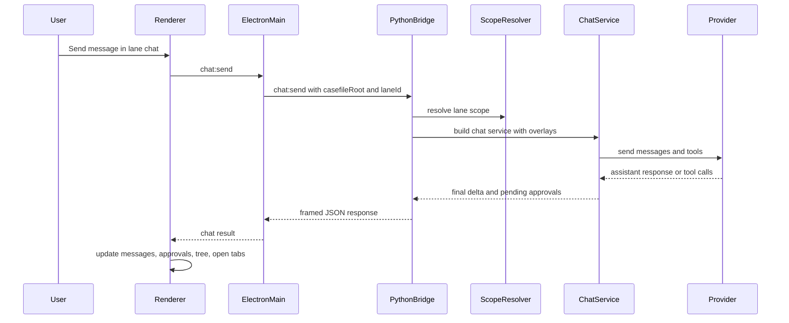

# Runtime Flows

This document explains the main runtime paths that exist in DeskAssist today.

It is intentionally grounded in the current codebase rather than an ideal future architecture. The goal is to make it easy to answer questions like:

- What happens when a user opens a casefile?
- What exactly is sent during a scoped chat?
- Where does comparison chat differ from lane chat?
- Which layer owns file IO, persistence, and watch refresh?

## Shared Flow Pattern

Most DeskAssist flows follow the same shape:

1. A React component triggers an action through `assistantApi`.
2. The preload layer forwards that action over IPC.
3. Electron main validates desktop state and either handles the action locally or calls the Python bridge.
4. The Python bridge dispatches to casefile, chat, or persistence services.
5. The result flows back to the renderer, which updates local UI state and may refresh workspace trees or tabs.

That shared pattern is important because it means most future features should reuse the same boundaries instead of bypassing them.

## Open Casefile And Switch Lane

Primary code paths:

- [`ui-electron/renderer/src/App.tsx`](../../ui-electron/renderer/src/App.tsx)
- [`ui-electron/preload.js`](../../ui-electron/preload.js)
- [`ui-electron/main.js`](../../ui-electron/main.js)
- [`src/assistant_app/electron_bridge.py`](../../src/assistant_app/electron_bridge.py)
- [`src/assistant_app/casefile/service.py`](../../src/assistant_app/casefile/service.py)

Sequence:

1. The user chooses a directory from the toolbar.
2. The renderer calls `assistantApi.chooseCasefile()` or `assistantApi.openCasefile(root)`.
3. Electron main opens a directory picker when needed, then sends `casefile:open` to the Python bridge.
4. The bridge resolves the directory, validates path depth, initializes `.casefile/` if needed, and returns a serialized snapshot.
5. Electron main adopts that snapshot into its process state:
   - `activeCasefileRoot`
   - `activeLaneId`
   - `activeLaneRoot`
6. Electron main reconciles filesystem watchers for the casefile and overlay roots.
7. The renderer stores the casefile snapshot and then triggers follow-up reloads:
   - workspace tree
   - lane chat history
   - notes
   - context manifest
   - prompts
   - inbox sources
   - overlays when enabled

Lane switching follows the same shape, except the bridge command is `casefile:switchLane` and the returned snapshot updates the active lane root instead of creating a new casefile.

Why it matters:

- the active lane root is the enforcement boundary for renderer-side file IO
- the casefile snapshot is the renderer's source of truth for current scoped work
- switching lanes is more than a selection change; it rebinds the workspace tree, notes, chats, and write scope

## Scoped Chat Send

Primary code paths:

- [`ui-electron/renderer/src/App.tsx`](../../ui-electron/renderer/src/App.tsx)
- [`ui-electron/main.js`](../../ui-electron/main.js)
- [`src/assistant_app/electron_bridge.py`](../../src/assistant_app/electron_bridge.py)
- [`src/assistant_app/chat_service.py`](../../src/assistant_app/chat_service.py)
- [`src/assistant_app/casefile/scope.py`](../../src/assistant_app/casefile/scope.py)

Sequence:

1. The renderer appends the user message optimistically to the in-memory lane session.
2. It calls `assistantApi.sendChat(...)` with:
   - provider
   - optional model override
   - prior message history
   - current `systemPromptId` if selected
   - `allowWriteTools` set to `false` for the initial turn
3. Electron main adds the active `casefileRoot` and `laneId`, applies saved model defaults when needed, and forwards `chat:send` to Python.
4. The bridge resolves the active lane scope:
   - lane write root
   - read overlays
   - casefile context files
5. The bridge builds a `ChatService` with a tool registry rooted at that scope.
6. The bridge injects system layers in order:
   - product-owned assistant charter
   - casefile context system prompt when applicable
   - selected prompt draft when applicable
7. `ChatService` sends the turn to the chosen provider with tool definitions.
8. If the model requests write tools, the turn pauses and the renderer receives pending approvals instead of executing writes immediately.
9. If the model requests only read tools, `ChatService` executes them inside the scoped registry and continues the loop until it gets a final assistant message or hits the tool-turn cap.
10. The bridge persists only the history delta into the lane chat log.
11. The renderer replaces its optimistic state with the canonical delta and refreshes the tree and clean open tabs.

Important current behaviors:

- the model can read only what the resolved scope exposes
- the model can write only after explicit approval
- write approval resumes the existing assistant turn instead of starting a new one
- the active prompt is lane-specific in the renderer, even though prompt drafts are casefile-scoped

## Comparison Chat

Primary code paths:

- [`ui-electron/renderer/src/components/LanesTab.tsx`](../../ui-electron/renderer/src/components/LanesTab.tsx)
- [`ui-electron/main.js`](../../ui-electron/main.js)
- [`src/assistant_app/electron_bridge.py`](../../src/assistant_app/electron_bridge.py)
- [`src/assistant_app/casefile/scope.py`](../../src/assistant_app/casefile/scope.py)

Sequence:

1. The user picks two lanes and opens a comparison chat from the `Lanes` tab.
2. The renderer calls `assistantApi.openComparison(laneIds)`.
3. Electron main forwards `casefile:openComparison` to the Python bridge.
4. The bridge validates the lane set, ensures comparison session metadata exists, resolves the comparison scope with each directory's configured read/write access, and loads persisted comparison chat history from the session UUID log.
5. The renderer registers the returned comparison session and focuses it in the `Chat` tab.
6. When the user sends a comparison message, the renderer calls `assistantApi.sendComparisonChat(...)`.
7. Electron main forwards the request to Python with the chosen lane ids and provider information.
8. The bridge builds a `ChatService` with:
   - scoped directories for each lane
   - ancestor and attachment scope entries
   - write tools enabled only when at least one scoped directory is writable
9. The assistant charter and comparison context are injected.
10. The provider runs against that scoped session and the bridge persists the resulting delta to the comparison chat log.

What is different from lane chat:

- the scope is the union of multiple lanes plus inherited scope entries
- each directory keeps its configured read/write access
- write tools still require explicit approval before execution
- the session id is synthetic and order-independent

This is an important early example of DeskAssist supporting multiple related contexts inside one workspace.

## File Browse, Open, Save, And Rename

Primary code paths:

- [`ui-electron/renderer/src/components/FileTree.tsx`](../../ui-electron/renderer/src/components/FileTree.tsx)
- [`ui-electron/renderer/src/App.tsx`](../../ui-electron/renderer/src/App.tsx)
- [`ui-electron/main.js`](../../ui-electron/main.js)

Sequence for listing and opening files:

1. The renderer calls `assistantApi.listWorkspace(maxDepth)` when the active lane changes or a refresh is needed.
2. Electron main lists the filesystem under `activeLaneRoot`.
3. The renderer renders the returned tree and, when enabled, separately loads overlay trees from `casefile:resolveScope`.
4. Clicking a regular file triggers `assistantApi.readFile(path)`.
5. Electron main validates that the path stays inside `activeLaneRoot`, reads bounded UTF-8 text, and returns content.
6. The renderer opens the file in an editor tab keyed by path.

Sequence for saving:

1. The user edits an open file tab.
2. The renderer calls `assistantApi.saveFile(path, content)`.
3. Electron main validates lane containment, creates parent directories if needed, and performs an atomic write through a temp file and rename.
4. The renderer updates the tab's saved baseline and refreshes the workspace tree.

Sequence for rename:

1. The user right-clicks a file in the tree and selects `Rename...`.
2. The renderer calls `assistantApi.renameFile(path, newName)`.
3. Electron main enforces same-directory rename semantics and refuses to overwrite.
4. The renderer refreshes the tree and patches any open tabs that pointed at the old path.

Important current limitations:

- the browser can rename existing entries, but does not yet provide first-class create, delete, or move actions
- overlay files are readable in the editor, but they are read-only views
- the file browser is already a navigation and context-selection surface, but not yet a complete workspace management surface

## Notes, Prompts, And Inbox Persistence

Primary code paths:

- [`ui-electron/renderer/src/App.tsx`](../../ui-electron/renderer/src/App.tsx)
- [`src/assistant_app/electron_bridge.py`](../../src/assistant_app/electron_bridge.py)
- [`src/assistant_app/casefile/notes.py`](../../src/assistant_app/casefile/notes.py)
- [`src/assistant_app/casefile/prompts.py`](../../src/assistant_app/casefile/prompts.py)
- [`src/assistant_app/casefile/inbox.py`](../../src/assistant_app/casefile/inbox.py)

Notes flow:

1. When the active lane changes, the renderer loads the note for that lane.
2. Edits are kept in renderer state and debounced before save.
3. The bridge writes note content to `.casefile/notes/<lane_id>.md`.

Prompt flow:

1. Prompt drafts are loaded at the casefile level.
2. Creating, saving, and deleting prompts all go through explicit bridge commands.
3. The selected prompt id is stored per lane in the renderer.
4. When selected, the prompt body is injected into chat as a tagged system message.

Inbox flow:

1. Inbox sources are configured at the casefile level.
2. The bridge persists source configuration to `.casefile/inbox.json`.
3. Item listing and bounded reads happen directly against the configured external directories.
4. Inbox items are currently read-only references, not lane-owned artifacts.

Why this matters:

These flows already prove that DeskAssist is not just a repo viewer with chat. The app already has multiple durable artifact channels and multiple persistence scopes:

- lane-scoped
- casefile-scoped
- external read-only source scoped

The next product step is to unify how those artifact types are framed and discovered.

## Filesystem Watch Refresh

Primary code paths:

- [`ui-electron/main.js`](../../ui-electron/main.js)
- [`ui-electron/preload.js`](../../ui-electron/preload.js)
- [`ui-electron/renderer/src/App.tsx`](../../ui-electron/renderer/src/App.tsx)

Sequence:

1. Electron main watches the active casefile root plus registered external overlay roots.
2. Changes are debounced and emitted as `workspace:changed`.
3. The renderer listens once and reacts by:
   - refreshing the active workspace tree
   - refreshing overlay trees
   - refreshing clean open tabs from disk

Why this matters:

DeskAssist already treats external changes as part of the live workspace instead of assuming the app owns every write. That is exactly the right behavior for a tool meant to coexist with Git, shells, editors, and assistant-driven writes.

## Flow Summary

The current runtime flows already support the core of DeskAssist's scoped-work model:

- open a workspace-like root
- branch that work into lanes
- scope AI to one lane or a comparison
- persist related notes, prompts, and source references
- keep the workbench live as files change

What is missing is less about mechanics and more about product coherence:

- clearer user-facing scope visibility
- more complete browser-driven actions
- a stronger home and resume flow
- a more unified artifact model
