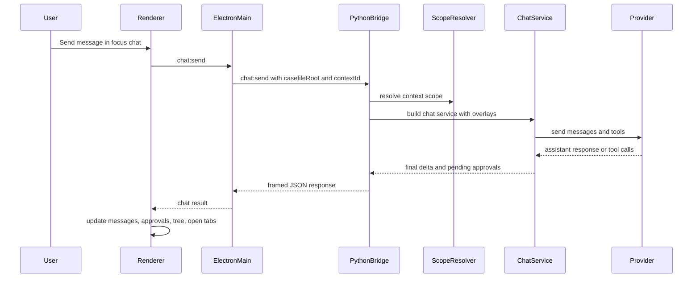

# Runtime Flows

This document explains the main runtime paths that exist in DeskAssist today.

It is intentionally grounded in the current codebase rather than an ideal future architecture. The goal is to make it easy to answer questions like:

- What happens when a user opens a casefile?
- What exactly is sent during a scoped chat?
- Where does comparison chat differ from context chat?
- Which layer owns file IO, persistence, and watch refresh?

## Shared Flow Pattern

Most DeskAssist flows follow the same shape:

1. A React component triggers an action through `assistantApi`.
2. The preload layer forwards that action over IPC.
3. Electron main validates desktop state and either handles the action locally or calls the Python bridge.
4. The Python bridge dispatches to casefile, chat, or persistence services.
5. The result flows back to the renderer, which updates local UI state and may refresh workspace trees or tabs.

That shared pattern is important because it means most future features should reuse the same boundaries instead of bypassing them.

## Open Casefile And Switch Focus

Primary code paths:

- [`ui-electron/renderer/src/App.tsx`](../../ui-electron/renderer/src/App.tsx)
- [`ui-electron/preload.js`](../../ui-electron/preload.js)
- [`ui-electron/main.js`](../../ui-electron/main.js)
- [`src/assistant_app/electron_bridge.py`](../../src/assistant_app/electron_bridge.py)
- [`src/assistant_app/casefile/service.py`](../../src/assistant_app/casefile/service.py)

Sequence:

1. The user chooses a directory from the toolbar.
2. The renderer calls `assistantApi.chooseCasefile()` or `assistantApi.openCasefile(root)`.
3. Electron main opens a directory picker when needed, then sends `casefile:open` to the Python bridge.
4. The bridge resolves the directory, validates path depth, initializes `.casefile/` if needed, and returns a serialized snapshot.
5. Electron main adopts that snapshot into its process state:
   - `activeCasefileRoot`
   - `activeContextId`
   - `activeContextRoot`
6. Electron main reconciles filesystem watchers for the casefile and overlay roots.
7. The renderer stores the casefile snapshot and then triggers follow-up reloads:
   - workspace tree
   - context chat history

Focus switching follows the same shape, except the bridge command is `casefile:switchContext` and the returned snapshot updates the active context root instead of creating a new casefile.

Why it matters:

- the active casefile root is the enforcement boundary for renderer-side file IO
- the active context root is still important for AI scope, terminal context, highlighting, and focus-specific chat state
- the casefile snapshot is the renderer's source of truth for current scoped work
- switching focus is more than a selection change; it rebinds chat history, active scope, terminal context, and file-tree highlighting

## Scoped Chat Send

Primary code paths:

- [`ui-electron/renderer/src/App.tsx`](../../ui-electron/renderer/src/App.tsx)
- [`ui-electron/main.js`](../../ui-electron/main.js)
- [`src/assistant_app/electron_bridge.py`](../../src/assistant_app/electron_bridge.py)
- [`src/assistant_app/chat_service.py`](../../src/assistant_app/chat_service.py)
- [`src/assistant_app/casefile/scope.py`](../../src/assistant_app/casefile/scope.py)

Sequence:

1. The renderer appends the user message optimistically to the in-memory focus session.
2. It calls `assistantApi.sendChat(...)` with:
   - provider
   - optional model override
   - prior message history
   - `allowWriteTools` set to `false` for the initial turn
3. Electron main adds the active `casefileRoot` and `contextId`, applies saved model defaults when needed, and forwards `chat:send` to Python.
4. The bridge resolves the active context scope:
   - context root as a scoped directory with its configured writable flag
   - attachment scoped directories with their configured read/write modes
   - casefile context files
5. The bridge builds a `ChatService` with a tool registry rooted at that scope.
6. The bridge injects system layers in order:
   - product-owned assistant charter
   - casefile context reference block when applicable
7. `ChatService` sends the turn to the chosen provider with tool definitions.
8. If the model requests write tools, the turn pauses and the renderer receives pending approvals instead of executing writes immediately.
9. If the model requests only read tools, `ChatService` executes them inside the scoped registry and continues the loop until it gets a final assistant message or hits the tool-turn cap.
10. The bridge persists only the history delta into the context chat log.
11. The renderer replaces its optimistic state with the canonical delta and refreshes the tree and clean open tabs.

Important current behaviors:

- the model can read only what the resolved scope exposes
- scoped directories are addressable as `_scope/<label>/...`; bare relative paths resolve inside the primary writable scoped directory when one exists
- the model can write only after explicit approval
- write approval resumes the existing assistant turn instead of starting a new one
- the scoped chat prompt stack is product-owned: charter first, then a casefile context reference block when applicable

## Comparison Chat

Primary code paths:

- [`ui-electron/renderer/src/components/ChatTab.tsx`](../../ui-electron/renderer/src/components/ChatTab.tsx)
- [`ui-electron/main.js`](../../ui-electron/main.js)
- [`src/assistant_app/electron_bridge.py`](../../src/assistant_app/electron_bridge.py)
- [`src/assistant_app/casefile/scope.py`](../../src/assistant_app/casefile/scope.py)

Sequence:

1. The user starts a comparison from the file tree or session UI by choosing two or more context-backed focuses.
2. The renderer calls `assistantApi.openComparison(contextIds)`.
3. Electron main forwards `casefile:openComparison` to the Python bridge.
4. The bridge validates the context set, ensures comparison session metadata exists, resolves the comparison scope with each directory's configured read/write access, and loads persisted comparison chat history from the session UUID log.
5. The renderer registers the returned comparison session and focuses it in the `Chat` tab.
6. When the user sends a comparison message, the renderer calls `assistantApi.sendComparisonChat(...)`.
7. Electron main forwards the request to Python with the chosen context ids and provider information.
8. The bridge builds a `ChatService` with:
   - scoped directories for each context
   - direct context attachments and comparison-session attachments
   - write tools enabled only when at least one scoped directory is writable
9. The assistant charter and comparison context reference block are injected.
10. The provider runs against that scoped session and the bridge persists the resulting delta to the comparison chat log.

What is different from context chat:

- the scope is the union of multiple context roots plus direct attachment entries
- each directory keeps its configured read/write access
- write tools still require explicit approval before execution
- the session id is synthetic and order-independent

Implementation audit note: comparison is no longer documented correctly as "pick two contexts from the `Contexts` tab." The current UI supports one or more additional contexts from the file tree, and the Python scope resolver accepts any comparison with at least two distinct context ids.

This is an important early example of DeskAssist supporting multiple related focuses inside one workspace.

## File Browse, Open, Save, Rename, Move, And Trash

Primary code paths:

- [`ui-electron/renderer/src/components/FileTree.tsx`](../../ui-electron/renderer/src/components/FileTree.tsx)
- [`ui-electron/renderer/src/App.tsx`](../../ui-electron/renderer/src/App.tsx)
- [`ui-electron/main.js`](../../ui-electron/main.js)

Sequence for listing and opening files:

1. The renderer calls `assistantApi.listWorkspace(maxDepth)` when the active context changes or a refresh is needed.
2. Electron main lists the filesystem under `activeCasefileRoot`.
3. The renderer renders the returned tree and marks active scope visually from the current casefile snapshot.
4. Clicking a regular file triggers `assistantApi.readFile(path)`.
5. Electron main validates that the path stays inside `activeCasefileRoot`, reads bounded UTF-8 text, and returns content.
6. The renderer opens the file in an editor tab keyed by path.

Sequence for saving:

1. The user edits an open file tab.
2. The renderer calls `assistantApi.saveFile(path, content)`.
3. Electron main validates casefile containment, creates parent directories if needed, and performs an atomic write through a temp file and rename.
4. The renderer updates the tab's saved baseline and refreshes the workspace tree.

Sequence for rename:

1. The user right-clicks a file in the tree and selects `Rename...`.
2. The renderer calls `assistantApi.renameFile(path, newName)`.
3. Electron main enforces same-directory rename semantics and refuses to overwrite.
4. The renderer refreshes the tree and patches any open tabs that pointed at the old path.

Additional browser actions:

- create file and create folder are first-class Electron main IPC operations
- move is available through dialogs and tree drag/drop, with overwrite prevention
- delete is implemented as recoverable OS trash plus a session-local undo stack
- context creation, attachment, comparison launch, context rename/removal, and context access toggles are available from the browser context surface

Implementation audit note: older references to file IO being active-context-contained are stale. The current file tree is casefile-wide; active context state affects scope, chat, terminal context, and visual highlighting rather than ordinary user file browsing.

## Current Workbench Surface

The current right panel is centered on scoped conversation sessions. Files and directories are handled by the browser and editor; comparison sessions use the same scoped-directory access model as focus chat. Future product work should improve discovery and resume without recreating separate storage-shaped tabs.

## Filesystem Watch Refresh

Primary code paths:

- [`ui-electron/main.js`](../../ui-electron/main.js)
- [`ui-electron/preload.js`](../../ui-electron/preload.js)
- [`ui-electron/renderer/src/App.tsx`](../../ui-electron/renderer/src/App.tsx)

Sequence:

1. Electron main watches the active casefile root plus registered external overlay roots.
2. Changes are debounced and emitted as `workspace:changed`.
3. The renderer listens once and reacts by:
   - refreshing the active workspace tree
   - refreshing clean open tabs from disk

Why this matters:

DeskAssist already treats external changes as part of the live workspace instead of assuming the app owns every write. That is exactly the right behavior for a tool meant to coexist with Git, shells, editors, and assistant-driven writes.

## Flow Summary

The current runtime flows already support the core of DeskAssist's scoped-work model:

- open a workspace-like root
- branch that work into focuses
- scope AI to one focus or a comparison
- save assistant responses and work with files as durable artifacts
- keep the workbench live as files change

What is missing is less about mechanics and more about product coherence:

- a unified artifact model beyond files and chat logs
- a stronger cross-focus continuity model than renderer-local recents
- a first non-code focus beyond quick capture inside an active workspace
