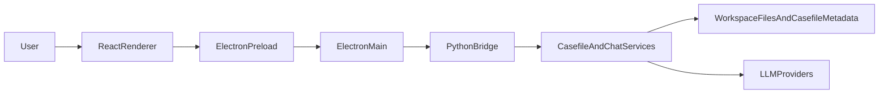

# System Overview

This document explains how DeskAssist works today as a running system.

The current application is not a browser app with a thin backend. It is a desktop workbench with three distinct runtime layers:

- an Electron main process that owns desktop capabilities and IPC
- a React renderer that owns most workbench and workflow state
- a Python backend that owns domain logic, scoping, chat orchestration, storage, and model/tool integration

That split is already a strong foundation. The main architectural tension is not "missing architecture." It is that the runtime architecture is clearer than the product architecture, and some internal concepts are still exposed more directly than the user-facing value.

## At A Glance

## Runtime Layers

## Electron Main Process

Primary implementation: [`ui-electron/main.js`](../../ui-electron/main.js)

Responsibilities today:

- create the application window and menus
- expose filesystem and terminal functionality through IPC
- keep track of the active casefile root and active context root
- run a Python subprocess for metadata and chat commands
- maintain filesystem watchers for the active casefile and external overlay roots
- host PTY-backed integrated terminal sessions
- manage API key persistence and preferred model selection

Why this layer exists:

- the renderer should not have direct Node or filesystem access
- desktop features such as PTY shells, file dialogs, menus, and watchers belong at the process boundary
- the Python bridge can stay stateless per request because Electron main owns app-level session context such as the active context root

Important consequence:

The main process is not just a transport shim. It already acts as a desktop shell service and stateful boundary for desktop-only capabilities.

## Preload Boundary

Primary implementation: [`ui-electron/preload.js`](../../ui-electron/preload.js)

Responsibilities today:

- expose a constrained `window.assistantApi` surface to the renderer
- convert renderer calls into named IPC requests
- hide raw `ipcRenderer` usage from React components

Why this layer matters:

- it is the security and ergonomics boundary between the renderer and Electron
- it defines the effective application API seen by the UI
- it reveals the current feature surface very clearly: workspaces, contexts, scoped chat, comparison chat, workspace IO, and terminals

## React Renderer

Primary implementation: [`ui-electron/renderer/src/App.tsx`](../../ui-electron/renderer/src/App.tsx)

Supporting implementations:

- [`ui-electron/renderer/src/components/RightPanel.tsx`](../../ui-electron/renderer/src/components/RightPanel.tsx)
- [`ui-electron/renderer/src/components/FileTree.tsx`](../../ui-electron/renderer/src/components/FileTree.tsx)
- [`ui-electron/renderer/src/components/HomeView.tsx`](../../ui-electron/renderer/src/components/HomeView.tsx)
- [`ui-electron/renderer/src/types.ts`](../../ui-electron/renderer/src/types.ts)

Responsibilities today:

- own most UI state for the workbench
- orchestrate context switching, recent contexts, editor tab state, comparison sessions, and chat history
- drive the three-column layout and integrated terminal panel
- translate UI actions into `assistantApi` calls
- reconcile filesystem change notifications into UI refreshes

Current strength:

The renderer already expresses the app as a single persistent workbench rather than a set of isolated modal screens.

Current weakness:

Much of the cross-feature orchestration is still concentrated in `App.tsx`, though some shell prop shaping and context workspace behavior has been extracted into renderer hooks. The renderer still effectively acts as:

- workbench coordinator
- session store
- chat session manager
- comparison session registry
- terminal session coordinator
- recent-context coordinator

This is one of the clearest refactor seams for the next phase.

## Python Bridge

Primary implementation: [`src/assistant_app/electron_bridge.py`](../../src/assistant_app/electron_bridge.py)

Responsibilities today:

- accept one JSON request from Electron main
- dispatch named commands such as `chat:send`, `casefile:open`, `casefile:openComparison`, and `casefile:updateContextAttachments`
- apply API keys to environment variables for provider use
- resolve casefile and context scope
- serialize responses back to Electron in a framed JSON payload

Why this layer matters:

- it keeps domain logic out of `main.js`
- it provides a stable command surface over Python services and stores
- it lets the frontend talk in application-level concepts instead of directly reimplementing storage or scope rules

## Python Domain Services

Primary implementations:

- [`src/assistant_app/chat_service.py`](../../src/assistant_app/chat_service.py)
- [`src/assistant_app/casefile/service.py`](../../src/assistant_app/casefile/service.py)
- [`src/assistant_app/casefile/store.py`](../../src/assistant_app/casefile/store.py)
- [`src/assistant_app/casefile/scope.py`](../../src/assistant_app/casefile/scope.py)

Responsibilities today:

- manage the casefile lifecycle and context persistence
- resolve scope for single-context and comparison chats
- build tool registries with read and write permissions
- inject the assistant charter and casefile context into chat history
- persist chat deltas and workspace/context metadata
- expose bounded, scoped filesystem access

The most important current domain center is:

`casefile -> context -> scope -> overlays`

That chain is what makes DeskAssist more than a generic repo chat UI. It is already the core of the app's scoped-work behavior.

## Providers And Tools

Provider implementations:

- [`src/assistant_app/providers/openai.py`](../../src/assistant_app/providers/openai.py)
- [`src/assistant_app/providers/anthropic.py`](../../src/assistant_app/providers/anthropic.py)
- [`src/assistant_app/providers/deepseek.py`](../../src/assistant_app/providers/deepseek.py)

Tool implementations:

- [`src/assistant_app/tools/registry.py`](../../src/assistant_app/tools/registry.py)
- [`src/assistant_app/tools/file_tools.py`](../../src/assistant_app/tools/file_tools.py)
- [`src/assistant_app/security/policy.py`](../../src/assistant_app/security/policy.py)

Current model:

- providers normalize API-specific chat responses into one internal shape
- tools are exposed to models through a registry with per-command schemas and permissions
- write tools require explicit approval from the renderer before execution
- comparison chat uses the same per-directory read/write scope model as context chat

This is a solid safety model for the current scope of the app.

## Persistence Model

DeskAssist currently stores user-facing state in two broad places:

- the workspace or context filesystem itself
- a `.casefile/` metadata directory rooted at the selected casefile

The current `.casefile/` model includes:

- `contexts.json` for context definitions and the active context
- `comparisons.json` for persistent comparison session metadata
- `chats/<session_uuid>.jsonl` for context and comparison chat history
- `context.json` for casefile-wide auto-include patterns

The renderer also keeps a small user-level recent-context index in `localStorage` via [`ui-electron/renderer/src/lib/recentContexts.ts`](../../ui-electron/renderer/src/lib/recentContexts.ts). That supports the current home/recents surface, but it is not yet a backend-backed user-level persistence model.

Relevant code:

- [`src/assistant_app/casefile/models.py`](../../src/assistant_app/casefile/models.py)
- [`src/assistant_app/casefile/store.py`](../../src/assistant_app/casefile/store.py)

This persistence model already separates durable context metadata from context-owned workspace files, which is exactly the kind of split DeskAssist needs for scoped work.

## Scope Resolution Model

Primary implementation: [`src/assistant_app/casefile/scope.py`](../../src/assistant_app/casefile/scope.py)

The current scoping model is one of the most mature parts of the system.

For a context chat, the resolved scope includes:

- the context root as a scoped directory with its own writable flag
- zero or more attachment scoped directories, each with its own read/write mode
- zero or more casefile context files under `_context/...`

For a comparison chat, the resolved scope includes:

- a stable synthetic comparison id
- scoped directory entries for each participating context
- direct attachment scope entries for participating contexts plus any comparison-session attachments
- casefile context files
- write tools when at least one scoped directory is writable

That gives DeskAssist a controllable model of what the AI can read or write without giving up stable workspace organization.

The current code resolves scope as a flat set of `_scope/<label>/...` directories; structural parents are UI organization only and are not inherited into AI scope.

## Current Information Architecture

The current UI is organized around a single right-panel chat surface plus the workspace tree/editor/terminal workbench.

Relevant code: [`ui-electron/renderer/src/components/RightPanel.tsx`](../../ui-electron/renderer/src/components/RightPanel.tsx)

This organization reflects the M2.5 correction: former storage-shaped tabs were removed so the scoped chat and workspace browser carry the primary workflow.

This matches the README's diagnosis that internal concepts are more visible than user value.

## Strengths In The Current Architecture

- The runtime split is clear and sensible for a desktop app.
- Scope resolution is already a real differentiator, not a placeholder.
- Storage is explicit and testable rather than hidden in renderer-only state.
- Comparison chat intentionally follows the same per-directory read/write scope rules as context chat.
- The file tree, editor, chat, and terminal already form a credible always-open workbench.

## Pressure Points

- The renderer is carrying too much orchestration in one component tree.
- The product language in the README does not yet line up cleanly with the UI's visible concepts.
- File browsing and context creation are related workflows but still feel separate in the implementation.
- Chats and files are artifact-like, but the system does not yet provide a unified artifact model.
- A home/recents surface exists, but it is still lightweight: it uses renderer `localStorage`, lists recent and pinned casefiles/active contexts, and offers quick capture inside an opened workspace. It is not yet the full cross-context continuity or non-code context model described by later milestones.

## Architectural Summary

DeskAssist already has a real architecture. The next step is not to replace it. The next step is to:

- preserve the current runtime split
- keep the strong scope model
- reduce renderer coupling
- move from implementation-driven surfaces to context- and artifact-driven product surfaces

That is the architectural bridge between the current codebase and the vision in [`../../README.md`](../../README.md).
