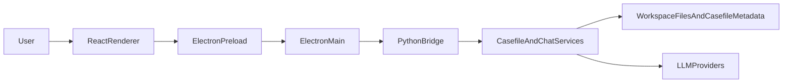

# System Overview

This document explains how DeskAssist works today as a running system.

The current application is not a browser app with a thin backend. It is a desktop workbench with three distinct runtime layers:

- an Electron main process that owns desktop capabilities and IPC
- a React renderer that owns most workbench and workflow state
- a Python backend that owns domain logic, scoping, chat orchestration, storage, and model/tool integration

That split is already a strong foundation. The main architectural tension is not "missing architecture." It is that the runtime architecture is clearer than the product architecture, and some internal concepts are still exposed more directly than the user-facing value.

## At A Glance

## Runtime Layers

## Electron Main Process

Primary implementation: [`ui-electron/main.js`](../../ui-electron/main.js)

Responsibilities today:

- create the application window and menus
- expose filesystem and terminal functionality through IPC
- keep track of the active casefile root and active lane root
- run a Python subprocess for metadata and chat commands
- maintain filesystem watchers for the active casefile and external overlay roots
- host PTY-backed integrated terminal sessions
- manage API key persistence and preferred model selection

Why this layer exists:

- the renderer should not have direct Node or filesystem access
- desktop features such as PTY shells, file dialogs, menus, and watchers belong at the process boundary
- the Python bridge can stay stateless per request because Electron main owns app-level session context such as the active lane root

Important consequence:

The main process is not just a transport shim. It already acts as a desktop shell service and stateful boundary for desktop-only capabilities.

## Preload Boundary

Primary implementation: [`ui-electron/preload.js`](../../ui-electron/preload.js)

Responsibilities today:

- expose a constrained `window.assistantApi` surface to the renderer
- convert renderer calls into named IPC requests
- hide raw `ipcRenderer` usage from React components

Why this layer matters:

- it is the security and ergonomics boundary between the renderer and Electron
- it defines the effective application API seen by the UI
- it reveals the current feature surface very clearly: casefiles, lanes, notes, prompts, inbox, comparison chat, workspace IO, and terminals

## React Renderer

Primary implementation: [`ui-electron/renderer/src/App.tsx`](../../ui-electron/renderer/src/App.tsx)

Supporting implementations:

- [`ui-electron/renderer/src/components/RightPanel.tsx`](../../ui-electron/renderer/src/components/RightPanel.tsx)
- [`ui-electron/renderer/src/components/FileTree.tsx`](../../ui-electron/renderer/src/components/FileTree.tsx)
- [`ui-electron/renderer/src/components/LanesTab.tsx`](../../ui-electron/renderer/src/components/LanesTab.tsx)
- [`ui-electron/renderer/src/types.ts`](../../ui-electron/renderer/src/types.ts)

Responsibilities today:

- own most UI state for the entire workbench
- orchestrate lane switching, tab state, notes, prompts, inboxes, comparisons, and chat history
- drive the three-column layout and integrated terminal panel
- translate UI actions into `assistantApi` calls
- reconcile filesystem change notifications into UI refreshes

Current strength:

The renderer already expresses the app as a single persistent workbench rather than a set of isolated modal screens.

Current weakness:

Too much cross-feature orchestration is concentrated in `App.tsx`. That makes the runtime understandable, but it also means the renderer currently acts as:

- workbench coordinator
- session store
- chat session manager
- notes state manager
- prompt selection manager
- comparison session registry
- overlay refresh coordinator
- terminal session coordinator

This is one of the clearest refactor seams for the next phase.

## Python Bridge

Primary implementation: [`src/assistant_app/electron_bridge.py`](../../src/assistant_app/electron_bridge.py)

Responsibilities today:

- accept one JSON request from Electron main
- dispatch named commands such as `chat:send`, `casefile:open`, `casefile:compareLanes`, and `casefile:listPrompts`
- apply API keys to environment variables for provider use
- resolve casefile and lane scope
- serialize responses back to Electron in a framed JSON payload

Why this layer matters:

- it keeps domain logic out of `main.js`
- it provides a stable command surface over Python services and stores
- it lets the frontend talk in application-level concepts instead of directly reimplementing storage or scope rules

## Python Domain Services

Primary implementations:

- [`src/assistant_app/chat_service.py`](../../src/assistant_app/chat_service.py)
- [`src/assistant_app/casefile/service.py`](../../src/assistant_app/casefile/service.py)
- [`src/assistant_app/casefile/store.py`](../../src/assistant_app/casefile/store.py)
- [`src/assistant_app/casefile/scope.py`](../../src/assistant_app/casefile/scope.py)

Responsibilities today:

- manage the casefile lifecycle and lane persistence
- resolve scope for single-lane and comparison chats
- build tool registries with read and write permissions
- inject the assistant charter, casefile context, and selected prompts into chat history
- persist chat deltas, notes, prompts, and inbox configuration
- expose bounded, scoped filesystem access

The most important current domain center is:

`casefile -> lane -> scope -> overlays`

That chain is what makes DeskAssist more than a generic repo chat UI. It is already the core of the app's scoped-work behavior.

## Providers And Tools

Provider implementations:

- [`src/assistant_app/providers/openai.py`](../../src/assistant_app/providers/openai.py)
- [`src/assistant_app/providers/anthropic.py`](../../src/assistant_app/providers/anthropic.py)
- [`src/assistant_app/providers/deepseek.py`](../../src/assistant_app/providers/deepseek.py)

Tool implementations:

- [`src/assistant_app/tools/registry.py`](../../src/assistant_app/tools/registry.py)
- [`src/assistant_app/tools/file_tools.py`](../../src/assistant_app/tools/file_tools.py)
- [`src/assistant_app/security/policy.py`](../../src/assistant_app/security/policy.py)

Current model:

- providers normalize API-specific chat responses into one internal shape
- tools are exposed to models through a registry with per-command schemas and permissions
- write tools require explicit approval from the renderer before execution
- comparison chat disables write tools entirely

This is a solid safety model for the current scope of the app.

## Persistence Model

DeskAssist currently stores user-facing state in two broad places:

- the workspace or lane filesystem itself
- a `.casefile/` metadata directory rooted at the selected casefile

The current `.casefile/` model includes:

- `lanes.json` for lane definitions and the active lane
- `chats/<lane_id>.jsonl` for lane chat history
- `chats/_compare__...jsonl` for comparison chat history
- `notes/<lane_id>.md` for per-lane notes
- `prompts/<id>.md` and `prompts/<id>.json` for prompt drafts
- `context.json` for casefile-wide auto-include patterns
- `inbox.json` for configured external inbox sources

Relevant code:

- [`src/assistant_app/casefile/models.py`](../../src/assistant_app/casefile/models.py)
- [`src/assistant_app/casefile/store.py`](../../src/assistant_app/casefile/store.py)
- [`src/assistant_app/casefile/notes.py`](../../src/assistant_app/casefile/notes.py)
- [`src/assistant_app/casefile/prompts.py`](../../src/assistant_app/casefile/prompts.py)
- [`src/assistant_app/casefile/inbox.py`](../../src/assistant_app/casefile/inbox.py)

This persistence model already separates durable context metadata from lane-owned workspace files, which is exactly the kind of split DeskAssist needs for scoped work.

## Scope Resolution Model

Primary implementation: [`src/assistant_app/casefile/scope.py`](../../src/assistant_app/casefile/scope.py)

The current scoping model is one of the most mature parts of the system.

For a lane chat, the resolved scope includes:

- one write root, which is the lane's own root
- zero or more read-only attachment overlays
- zero or more ancestor lane overlays
- zero or more ancestor attachment overlays
- zero or more casefile context files under `_context/...`

For a comparison chat, the resolved scope includes:

- a stable synthetic comparison id
- read-only lane overlays for each participating lane
- inherited ancestor and attachment overlays
- casefile context files
- no write tools

That gives DeskAssist a controllable model of "what the AI can read" without giving up stable workspace organization.

## Current Information Architecture

The current UI is organized around right-panel tabs:

- `Chat`
- `Notes`
- `Lanes`
- `Prompts`
- `Inbox`

Relevant code: [`ui-electron/renderer/src/components/RightPanel.tsx`](../../ui-electron/renderer/src/components/RightPanel.tsx)

This organization reflects implementation maturity more than product framing:

- `Lanes` is both a setup screen and a core workflow screen
- `Prompts` and `Notes` are durable artifact types, but appear as separate feature destinations
- `Inbox` is a source management concept, not yet a higher-level context workflow

This matches the README's diagnosis that internal concepts are more visible than user value.

## Strengths In The Current Architecture

- The runtime split is clear and sensible for a desktop app.
- Scope resolution is already a real differentiator, not a placeholder.
- Storage is explicit and testable rather than hidden in renderer-only state.
- Comparison chat is intentionally read-only and follows the same scope rules.
- The file tree, editor, chat, and terminal already form a credible always-open workbench.

## Pressure Points

- The renderer is carrying too much orchestration in one component tree.
- The product language in the README does not yet line up cleanly with the UI's visible concepts.
- File browsing and lane creation are related workflows but still feel separate in the implementation.
- Notes, prompts, inbox items, chats, and files are all artifact-like, but the system still presents them as separate feature surfaces.
- The current shell can do many things, but it does not yet provide a strong "resume and switch context" home experience.

## Architectural Summary

DeskAssist already has a real architecture. The next step is not to replace it. The next step is to:

- preserve the current runtime split
- keep the strong scope model
- reduce renderer coupling
- move from implementation-driven surfaces to context- and artifact-driven product surfaces

That is the architectural bridge between the current codebase and the vision in [`../../README.md`](../../README.md).
