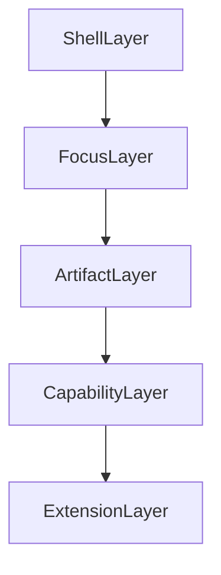

# Target V1 Architecture

This document translates the product architecture in [`../../README.md`](../../README.md) into a technical target state for DeskAssist V1.

It is not a rewrite proposal. It is a shaping document for how the current codebase should evolve.

The central V1 bet remains:

**a unified focus-switching workspace with scoped AI**

The architecture should make that bet obvious in both the user experience and the code structure.

## Design Goals

V1 architecture should:

- preserve the current strength of the scoped chat and comparison model
- make the shell feel reliable and boring in a good way
- promote focuses and artifacts over internal feature silos
- let browsing, editing, comparison, and capture feel like one workflow
- prepare for future integrations without making them part of the core too early

## Target Shape

The key idea is that each layer should depend on the layer below it conceptually, but the product should be experienced from the top down:

- the user lives in the shell
- the shell helps the user move between focuses
- focuses contain or reference artifacts
- capabilities operate over those artifacts
- extensions add optional inputs and outputs

## Layer 1: Shell

Product meaning:

The shell is the always-open DeskAssist environment: layout, navigation, resume, switching, persistence of current state, and integrated tools such as the terminal.

Current implementation:

- Electron windowing and menus in [`ui-electron/main.js`](../../ui-electron/main.js)
- workbench layout and state in [`ui-electron/renderer/src/App.tsx`](../../ui-electron/renderer/src/App.tsx)
- split panes, right panel, terminal pane, toolbar, and tab state in the renderer component tree

What already aligns:

- persistent workbench layout
- integrated terminal
- live file watching
- one-window workspace model

Where the current system leaks:

- the home/landing experience exists, but is still lightweight and renderer-local
- too much shell state and workflow state are mixed together in `App.tsx`
- the right panel has been reduced to chat/conversation sessions, but broader artifact and focus presentation is still incomplete

V1 target:

- a shell state model distinct from domain and session state
- a meaningful workspace home or resume surface
- predictable pane and panel behavior
- first-class focus switching rather than indirect active-context switching only

Recommended technical boundary:

Split renderer state into at least three concerns:

- shell and layout state
- focus and session state
- settings and integrations state

## Layer 2: Focuses

Product meaning:

Focuses are the units the user switches between: active work areas, scoped conversations, comparisons, capture spaces, and later non-code spaces such as a journal.

Current implementation:

- contexts inside a casefile
- comparison sessions across multiple contexts
- active context plus associated tabs, chat, attachments, scope header, and comparison sessions
- renderer-local recent work records shown in the home view and toolbar

What already aligns:

- contexts already implement durable scoped focuses
- comparison sessions already behave like multi-focus scoped sessions
- the active context already rebinds chat, terminal context, AI scope, and file-tree highlighting

Where the current system leaks:

- `context` is a useful implementation term, but not the broad user-facing term
- focuses are surfaced through recent casefile/active-context records rather than a complete first-class focus registry
- home and recency exist, but persistence is still renderer `localStorage`, not the durable user-level index implied by the V1 target

V1 target:

- a focus registry or focus list the shell can display
- clear distinction between:
  - single focus
  - comparison focus
  - capture focus
  - future non-code focus
- explicit current-scope visibility inside each focus

Recommended technical boundary:

Introduce a renderer-side focus session model that is broader than raw context selection. The current context model can remain the storage and scoping implementation for many focuses, but the UI should operate on focus sessions.

## Layer 3: Artifacts

Product meaning:

Artifacts are the things users actually work with: files, chat transcripts, comparisons, context files, related directories, and future captured material.

Current implementation:

- files through casefile-contained Electron file IO
- chat logs through casefile chat persistence
- comparison sessions through comparison chat logs
- saved assistant responses through the `Save...` flow into user-selected allowed destinations

What already aligns:

- multiple artifact types already exist
- artifact persistence is explicit and mostly durable
- the app already supports both owned artifacts and referenced artifacts

Where the current system leaks:

- capture/discovery is still under-modeled after removing the old storage-shaped tabs
- there is no shared artifact vocabulary or browser surface

V1 target:

- a coherent artifact model, even if it is still backed by multiple stores
- easier insertion of captured material into chat and workflows
- a clearer difference between:
  - focus-owned files
  - casefile-scoped files
  - external reference directories

Recommended technical boundary:

Define an artifact descriptor shape in the renderer and backend that can normalize the minimum shared metadata:

- id or path
- type
- owner scope
- source
- display name
- open or inspect action

This does not require a single storage system yet. It does require a consistent way to refer to artifacts in the product.

## Layer 4: Capabilities

Product meaning:

Capabilities are the actions DeskAssist makes available over focuses and artifacts:

- browse
- open
- edit
- compare
- chat
- narrow scope
- widen scope
- search
- capture

Current implementation:

- browsing and editing through Electron main and the renderer workbench
- compare through scoped comparison chat
- chat through the Python bridge and `ChatService`
- scoped focus through context and comparison scope resolution
- quick capture opens or creates `quick-capture.md` inside the active workspace

What already aligns:

- scoped chat is real
- comparison is real
- browsing and editing are real
- browser-driven create, move, trash, rename, context creation, attachment, and comparison entry points are real
- current-scope framing is visible in the chat header
- quick capture exists as a lightweight file workflow
- bounded write approval is real

Where the current system leaks:

- quick capture is tied to an active workspace rather than being a standalone non-code focus
- scope adjustment exists, but still depends on context/attachment mechanics that are more implementation-shaped than product-shaped

V1 target:

- browser-driven scope and compare entry points
- always-visible current-scope framing
- lightweight capture pathways that do not force a tab switch or concept switch
- a clean distinction between capabilities and storage models

Recommended technical boundary:

Treat capabilities as workflows that can be initiated from multiple surfaces. For example:

- compare should be launchable from the browser or context home
- capture should be launchable from the shell, current focus, or home
- scope controls should live with chat and focus state, not only in setup-oriented screens

## Layer 5: Extensions

Product meaning:

Extensions are optional systems that feed or consume workspace information without redefining the core product.

Examples from the roadmap:

- email
- Slack
- messages
- calendar or task systems
- health or life logs
- automation plugins

Current implementation:

- no formal extension framework yet
- explicit context attachments are the closest existing example of an external material source
- provider integrations exist, but they are model providers rather than product extensions

V1 target:

- explicit extension boundaries
- optional registration and permissions model
- background service boundary where needed
- no change to the core shell or scope model when an extension is absent

Recommended technical boundary:

Do not build extension-specific logic directly into context or file-browser code. Add an adapter layer once the core shell, context, and file/artifact model are stable.

## Current-To-Target Mapping

What should stay:

- Electron main as the desktop capability boundary
- Python bridge and service layer
- casefile storage model
- context-based scope resolution
- comparison session model
- write approval guardrails

What should evolve:

- renderer state ownership
- visible navigation and panel structure
- user-facing language around focus, scope, comparison, and files
- artifact presentation from tab silos to unified access patterns

What should be introduced:

- durable user-level home and resume state beyond renderer `localStorage`
- fuller focus session framing above raw contexts
- artifact descriptors and artifact-oriented entry points
- clearer artifact discovery and non-code focus support
- extension contracts after core loops are strong

## Most Important Separation To Add

The clearest architectural move for V1 is to separate:

- how work is stored
- how work is scoped
- how work is presented

Today those layers overlap too much.

Examples:

- contexts are storage records that still leak into user-facing concepts
- chat sessions are now the right-panel focus, but artifact and focus discovery still lack a unified presentation layer
- `App.tsx` mixes shell coordination with domain session logic

V1 should aim for:

- storage modeled by casefile and context persistence
- scope modeled by dedicated scope services and visible scope UI
- presentation modeled by workspace, focus, and artifact surfaces

## Refactor Seams To Respect

The current code suggests several safe seams for incremental improvement:

1. Extract renderer state from [`ui-electron/renderer/src/App.tsx`](../../ui-electron/renderer/src/App.tsx) into smaller stores or hooks grouped by concern.
2. Keep [`src/assistant_app/casefile/scope.py`](../../src/assistant_app/casefile/scope.py) as the scope engine and avoid duplicating scope rules in the renderer.
3. Treat [`ui-electron/preload.js`](../../ui-electron/preload.js) as the public app API surface and evolve it intentionally.
4. Keep comparison chat governed by the same per-directory read/write scope model as context chat.
5. Let new artifact-oriented surfaces call existing stores first before introducing a new persistence abstraction.

## Non-Goals For V1

V1 architecture should explicitly avoid:

- turning every artifact type into a top-level destination
- building integrations before the shell and focus model feel complete
- collapsing all persistence into one generic database purely for symmetry
- replacing working scope mechanics just to make the naming cleaner

## V1 Architecture Summary

The target V1 architecture is not "replace casefiles and contexts."

It is:

- keep the current runtime split
- keep the current scope engine
- keep focus and context language consistent across product and implementation docs
- raise the information model from tabs to artifacts
- strengthen the shell so DeskAssist feels like one reliable daily workspace

If that happens, the codebase can continue to use the current strong scoped-work machinery while the product grows into the broader second-brain vision described in the README.
