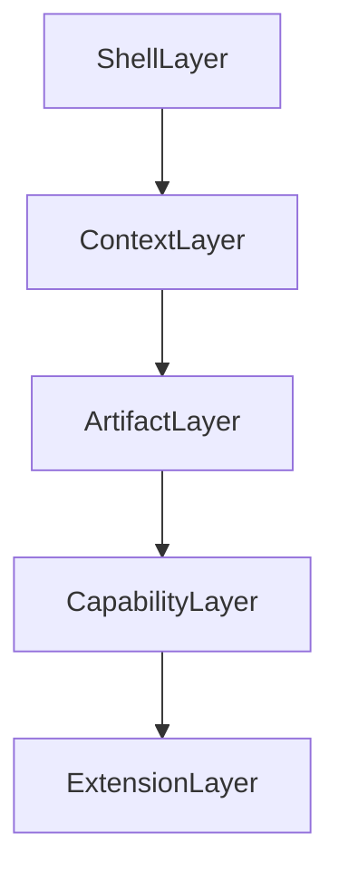

# Target V1 Architecture

This document translates the product architecture in [`../../README.md`](../../README.md) into a technical target state for DeskAssist V1.

It is not a rewrite proposal. It is a shaping document for how the current codebase should evolve.

The central V1 bet remains:

**a unified context-switching workspace with scoped AI**

The architecture should make that bet obvious in both the user experience and the code structure.

## Design Goals

V1 architecture should:

- preserve the current strength of the scoped chat and comparison model
- make the shell feel reliable and boring in a good way
- promote contexts and artifacts over internal feature silos
- let browsing, editing, comparison, and capture feel like one workflow
- prepare for future integrations without making them part of the core too early

## Target Shape

The key idea is that each layer should depend on the layer below it conceptually, but the product should be experienced from the top down:

- the user lives in the shell
- the shell helps the user move between contexts
- contexts contain or reference artifacts
- capabilities operate over those artifacts
- extensions add optional inputs and outputs

## Layer 1: Shell

Product meaning:

The shell is the always-open DeskAssist environment: layout, navigation, resume, switching, persistence of current state, and integrated tools such as the terminal.

Current implementation:

- Electron windowing and menus in [`ui-electron/main.js`](../../ui-electron/main.js)
- workbench layout and state in [`ui-electron/renderer/src/App.tsx`](../../ui-electron/renderer/src/App.tsx)
- split panes, right panel, terminal pane, toolbar, and tab state in the renderer component tree

What already aligns:

- persistent workbench layout
- integrated terminal
- live file watching
- one-window workspace model

Where the current system leaks:

- there is no strong home or landing experience
- too much shell state and workflow state are mixed together in `App.tsx`
- the right panel is still organized as subsystem tabs rather than user outcomes

V1 target:

- a shell state model distinct from domain and session state
- a meaningful workspace home or resume surface
- predictable pane and panel behavior
- first-class context switching rather than indirect lane switching only

Recommended technical boundary:

Split renderer state into at least three concerns:

- shell and layout state
- context and session state
- settings and integrations state

## Layer 2: Contexts

Product meaning:

Contexts are the units the user switches between: active work areas, scoped conversations, comparisons, note areas, and later non-code spaces such as a journal.

Current implementation:

- lanes inside a casefile
- comparison sessions across multiple lanes
- active lane plus associated notes, tabs, chat, and overlays

What already aligns:

- lanes are durable scoped work units
- comparison sessions already behave like read-only multi-context sessions
- the active lane already rebinds the workspace tree, notes, and write scope

Where the current system leaks:

- `lane` is a useful implementation term, but not a broad user-facing term
- contexts are not yet surfaced as a first-class navigable concept
- the home and recency model for contexts does not exist yet

V1 target:

- a context registry or context list the shell can display
- clear distinction between:
  - single context
  - comparison context
  - capture context
  - future non-code context
- explicit current-scope visibility inside each context

Recommended technical boundary:

Introduce a renderer-side context session model that is broader than raw lane selection. The current lane model can remain the storage and scoping implementation for many contexts, but the UI should operate on context sessions.

## Layer 3: Artifacts

Product meaning:

Artifacts are the things users actually work with: files, notes, prompts, chat transcripts, comparisons, context files, attachments, and external source material.

Current implementation:

- files through lane-root file IO
- notes through `NotesStore`
- prompts through `PromptsStore`
- inbox items through `InboxStore`
- chat logs through casefile chat persistence
- comparison results through compare services and comparison logs

What already aligns:

- multiple artifact types already exist
- artifact persistence is explicit and mostly durable
- the app already supports both owned artifacts and referenced artifacts

Where the current system leaks:

- notes, prompts, and inbox are presented as parallel tabs rather than related artifact types
- discoverability is siloed by storage subsystem
- there is no shared artifact vocabulary or browser surface

V1 target:

- a coherent artifact model, even if it is still backed by multiple stores
- easier insertion of prompts and notes into chat and workflows
- a clearer difference between:
  - lane-owned artifacts
  - casefile-scoped artifacts
  - external reference artifacts

Recommended technical boundary:

Define an artifact descriptor shape in the renderer and backend that can normalize the minimum shared metadata:

- id or path
- type
- owner scope
- source
- display name
- open or inspect action

This does not require a single storage system yet. It does require a consistent way to refer to artifacts in the product.

## Layer 4: Capabilities

Product meaning:

Capabilities are the actions DeskAssist makes available over contexts and artifacts:

- browse
- open
- edit
- compare
- chat
- narrow scope
- widen scope
- search
- capture

Current implementation:

- browsing and editing through Electron main and the renderer workbench
- compare through casefile compare services and diff tabs
- chat through the Python bridge and `ChatService`
- scoped context through lane and comparison scope resolution
- capture through notes, prompts, and inbox source registration

What already aligns:

- scoped chat is real
- comparison is real
- browsing and editing are real
- bounded write approval is real

Where the current system leaks:

- some capabilities start from the `Lanes` tab rather than from the browser or context itself
- capture is split across notes, prompts, and inbox instead of one obvious workflow
- scope adjustment is technically strong but not yet obvious in the UI

V1 target:

- browser-driven scope and compare entry points
- always-visible current-scope framing
- lightweight capture pathways that do not force a tab switch or concept switch
- a clean distinction between capabilities and storage models

Recommended technical boundary:

Treat capabilities as workflows that can be initiated from multiple surfaces. For example:

- compare should be launchable from the browser, lane list, or context home
- capture should be launchable from the shell, current context, or home
- scope controls should live with chat and context state, not only in setup-oriented screens

## Layer 5: Extensions

Product meaning:

Extensions are optional systems that feed or consume workspace information without redefining the core product.

Examples from the roadmap:

- email
- Slack
- messages
- calendar or task systems
- health or life logs
- automation plugins

Current implementation:

- no formal extension framework yet
- inbox sources are the closest existing example of an external context source
- provider integrations exist, but they are model providers rather than product extensions

V1 target:

- explicit extension boundaries
- optional registration and permissions model
- background service boundary where needed
- no change to the core shell or scope model when an extension is absent

Recommended technical boundary:

Do not build extension-specific logic directly into lane, prompt, or file-browser code. Add an adapter layer once the core shell, context, and artifact model are stable.

## Current-To-Target Mapping

What should stay:

- Electron main as the desktop capability boundary
- Python bridge and service layer
- casefile storage model
- lane-based scope resolution
- comparison session model
- write approval guardrails

What should evolve:

- renderer state ownership
- visible navigation and panel structure
- language from `lane-centric` to `context-centric`
- artifact presentation from tab silos to unified access patterns

What should be introduced:

- workspace home and resume state
- context session framing above raw lanes
- artifact descriptors and artifact-oriented entry points
- clearer current-scope UI
- extension contracts after core loops are strong

## Most Important Separation To Add

The clearest architectural move for V1 is to separate:

- how work is stored
- how work is scoped
- how work is presented

Today those layers overlap too much.

Examples:

- lanes are both a storage record and a user-facing concept
- the right panel mixes artifact surfaces and workflow control surfaces
- `App.tsx` mixes shell coordination with domain session logic

V1 should aim for:

- storage modeled by casefile and lane persistence
- scope modeled by dedicated scope services and visible scope UI
- presentation modeled by workspace, context, and artifact surfaces

## Refactor Seams To Respect

The current code suggests several safe seams for incremental improvement:

1. Extract renderer state from [`ui-electron/renderer/src/App.tsx`](../../ui-electron/renderer/src/App.tsx) into smaller stores or hooks grouped by concern.
2. Keep [`src/assistant_app/casefile/scope.py`](../../src/assistant_app/casefile/scope.py) as the scope engine and avoid duplicating scope rules in the renderer.
3. Treat [`ui-electron/preload.js`](../../ui-electron/preload.js) as the public app API surface and evolve it intentionally.
4. Keep comparison chat read-only by construction.
5. Let new artifact-oriented surfaces call existing stores first before introducing a new persistence abstraction.

## Non-Goals For V1

V1 architecture should explicitly avoid:

- turning every artifact type into a top-level destination
- building integrations before the shell and context model feel complete
- collapsing all persistence into one generic database purely for symmetry
- replacing working scope mechanics just to make the naming cleaner

## V1 Architecture Summary

The target V1 architecture is not "replace casefiles and lanes."

It is:

- keep the current runtime split
- keep the current scope engine
- raise the product framing from lanes to contexts
- raise the information model from tabs to artifacts
- strengthen the shell so DeskAssist feels like one reliable daily workspace

If that happens, the codebase can continue to use the current strong scoped-work machinery while the product grows into the broader second-brain vision described in the README.
