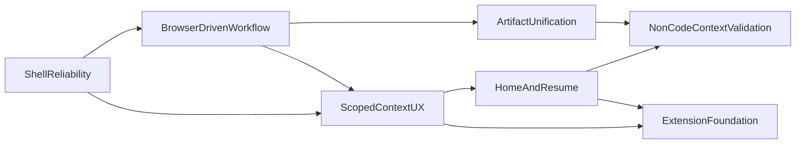

# Engineering Roadmap

This document translates the product roadmap in [`../../README.md`](../../README.md) into implementation-oriented workstreams.

It is meant to answer:

- what to build first
- which code areas are likely to move
- what each phase is trying to prove
- which workstreams are blocked on others

## Planning Principles

- Favor improvements to the core loops over surface-area growth.
- Preserve the current scoped-work strengths while improving product clarity.
- Prefer incremental refactors around known seams instead of broad rewrites.
- Keep integrations and non-core modules behind explicit boundaries.

## Workstream Dependency Shape

## Workstream 1: Shell Reliability

Goal:

Make the application feel stable enough for daily use.

Why it comes first:

- every other workflow is harder to evaluate when layout and panel behavior feel fragile
- the current README explicitly identifies shell roughness as the first user-facing issue to solve

Likely code hotspots:

- [`ui-electron/renderer/src/App.tsx`](../../ui-electron/renderer/src/App.tsx)
- [`ui-electron/renderer/src/components/Splitter.tsx`](../../ui-electron/renderer/src/components/Splitter.tsx)
- [`ui-electron/renderer/src/components/RightPanel.tsx`](../../ui-electron/renderer/src/components/RightPanel.tsx)
- [`ui-electron/renderer/src/styles.css`](../../ui-electron/renderer/src/styles.css)
- [`ui-electron/main.js`](../../ui-electron/main.js)

Focus areas:

- pane sizing and persistence
- right-panel usability at narrow widths
- tab and panel predictability
- terminal panel behavior
- clearer hierarchy between browser, editor, and chat/context areas

Exit criteria:

- the workbench remains usable across common window sizes
- resize behavior is predictable and recoverable
- terminal, editor, and right panel can coexist without layout fights
- common navigation actions no longer feel brittle

## Workstream 2: Browser-Driven Workflow

Goal:

Turn the file browser into a real control surface for work, not just a tree viewer.

Why it follows shell reliability:

- browser-centered actions depend on the layout already being trustworthy
- file and context actions should feel native to the main workspace, not layered on top of a shaky shell

Likely code hotspots:

- [`ui-electron/renderer/src/components/FileTree.tsx`](../../ui-electron/renderer/src/components/FileTree.tsx)
- [`ui-electron/renderer/src/App.tsx`](../../ui-electron/renderer/src/App.tsx)
- [`ui-electron/main.js`](../../ui-electron/main.js)
- [`ui-electron/preload.js`](../../ui-electron/preload.js)

Focus areas:

- create file
- create folder
- delete or move
- richer browser context actions
- create lane from browser selection
- attach artifacts to the current context from the browser
- launch compare and scope actions from browser selection

Exit criteria:

- a user can manage basic workspace structure without leaving DeskAssist
- browser actions feed directly into scope and compare workflows
- lane creation no longer feels like a setup detour disconnected from the files being worked on

## Workstream 3: Scoped Context UX

Goal:

Make DeskAssist's differentiator visible and understandable.

Why it is critical:

- the code already has a meaningful scope system
- the current UX makes that system feel more like internal setup than product value

Likely code hotspots:

- [`ui-electron/renderer/src/App.tsx`](../../ui-electron/renderer/src/App.tsx)
- [`ui-electron/renderer/src/components/ChatTab.tsx`](../../ui-electron/renderer/src/components/ChatTab.tsx)
- [`ui-electron/renderer/src/components/LanesTab.tsx`](../../ui-electron/renderer/src/components/LanesTab.tsx)
- [`ui-electron/renderer/src/components/ContextEditor.tsx`](../../ui-electron/renderer/src/components/ContextEditor.tsx)
- [`src/assistant_app/casefile/scope.py`](../../src/assistant_app/casefile/scope.py)
- [`src/assistant_app/electron_bridge.py`](../../src/assistant_app/electron_bridge.py)

Focus areas:

- explicit current-scope display
- better framing of lanes, comparisons, and overlays
- clearer compare session visibility
- narrow, widen, and switch scope controls
- stronger empty states and onboarding copy

Exit criteria:

- a new user can tell what the AI can currently read
- switching between single-context and comparison-context chat is intentional and obvious
- scope stops feeling like a hidden implementation detail

## Workstream 4: Home And Resume

Goal:

Introduce a real entry point that helps the user resume work and capture new work.

Why it depends on earlier work:

- the shell must be stable first
- contexts and scope need clearer language before the app can present recents and resume targets coherently

Likely code hotspots:

- [`ui-electron/renderer/src/App.tsx`](../../ui-electron/renderer/src/App.tsx)
- [`ui-electron/renderer/src/components/Toolbar.tsx`](../../ui-electron/renderer/src/components/Toolbar.tsx)
- new renderer components for home and recent-context views
- possibly new persistence for recent sessions or pinned contexts

Focus areas:

- home dashboard
- recent contexts
- pinned work
- resume last active chat or comparison
- quick capture
- jump targets into current work

Exit criteria:

- opening DeskAssist answers "where should I go next?"
- users can move from capture to active work without reconstructing their state manually
- the app starts to feel like a daily environment rather than only a task-specific tool

## Workstream 5: Artifact Unification

Goal:

Turn the current set of durable things into a clearer artifact model.

Why it matters:

- notes, prompts, files, inbox material, and chat outputs already behave like related artifact types
- the current UI treats them as separate tabs and stores, which increases conceptual clutter

Likely code hotspots:

- [`ui-electron/renderer/src/components/RightPanel.tsx`](../../ui-electron/renderer/src/components/RightPanel.tsx)
- [`ui-electron/renderer/src/components/NotesTab.tsx`](../../ui-electron/renderer/src/components/NotesTab.tsx)
- [`ui-electron/renderer/src/components/PromptsTab.tsx`](../../ui-electron/renderer/src/components/PromptsTab.tsx)
- [`ui-electron/renderer/src/components/InboxTab.tsx`](../../ui-electron/renderer/src/components/InboxTab.tsx)
- [`src/assistant_app/casefile/notes.py`](../../src/assistant_app/casefile/notes.py)
- [`src/assistant_app/casefile/prompts.py`](../../src/assistant_app/casefile/prompts.py)
- [`src/assistant_app/casefile/inbox.py`](../../src/assistant_app/casefile/inbox.py)

Focus areas:

- artifact descriptors or a shared metadata model
- better insertion of notes and prompts into chat workflows
- clearer distinction between owned artifacts and reference artifacts
- fewer top-level destinations dedicated only to storage subtypes

Exit criteria:

- notes and prompts feel necessary and connected to work
- artifact discovery is easier
- the UI presents fewer isolated feature silos

## Workstream 6: Non-Code Context Validation

Goal:

Validate that DeskAssist can support mixed project and personal work without broad integrations.

Recommended first target:

- journal, daily log, or scratch context

Why it comes after home and artifact work:

- the non-code context should arrive as a natural extension of the same context and artifact model, not as an unrelated special case

Likely code hotspots:

- new renderer surfaces for quick capture and journal entry
- persistence decisions near the casefile and artifact model
- scope presentation for bounded non-code chat slices

Exit criteria:

- a user can move between project work and personal capture naturally
- the product proves it is broader than repo chat without needing external integrations

## Workstream 7: Extension Foundation

Goal:

Define how future integrations enter the system without reshaping the core architecture.

Why it comes later:

- integrations can consume the roadmap without proving the core product
- extension boundaries are easiest to design once shell, context, and artifact boundaries are clearer

Likely code hotspots:

- Electron main process service boundaries
- renderer settings and registration surfaces
- future adapter or plugin contracts near the Python bridge and domain services

Focus areas:

- registration and discovery model
- permissions and configuration model
- optional background services
- keeping the core coherent when extensions are absent

Exit criteria:

- a future integration can be added without changing the basic shell and scope model
- the product still makes sense with zero extensions enabled

## Suggested Delivery Waves

Wave 1:

- shell reliability
- browser-driven workflow
- scoped context UX

Wave 2:

- home and resume
- artifact unification

Wave 3:

- non-code context validation
- extension foundation

## Architecture Rules During Delivery

- Do not duplicate scope logic in the renderer.
- Keep write safety centralized in the existing tool and bridge approval path.
- Prefer evolving `assistantApi` deliberately over ad hoc new IPC channels.
- Avoid broad state accretion in [`ui-electron/renderer/src/App.tsx`](../../ui-electron/renderer/src/App.tsx); extract by concern as work progresses.
- Keep comparison chat read-only by construction.

## Roadmap Summary

The roadmap is best understood as a sequence of clarification moves:

1. make the shell trustworthy
2. make browser-driven work complete
3. make scope legible
4. make context switching first-class
5. make artifacts coherent
6. validate broader mixed-mode work
7. prepare clean extension boundaries

That sequence keeps DeskAssist centered on its actual advantage: continuous, controllable, multi-context work in one environment.
